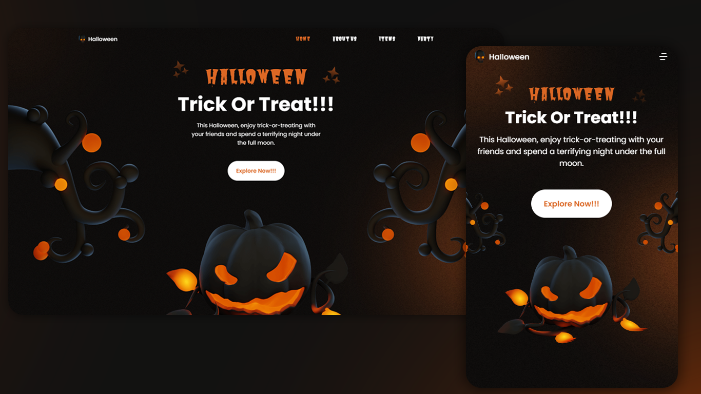

#  **Halloween Responsive Website**

 

## 	&#127919; **About**
Um site com temática de Halloween, interativo e com efeito de scroll reveal  
Este Projéto foi criado com base no tutorial do Canal <a href="https://www.youtube.com/watch?v=TBEOARNn2Gc&ab_channel=Bedimcode">Bendim Code</a> 

 

## 📋**My Experience**
Sempre deixo bem claro que o Halloween é a a minha data favorita do ano, e esse site foi super gostoso de fazer, consegui entender bem na pratica o conceito de **Mobile First** e também alguns truques de **CSS**

## 🔧 **Techs**

* HTML
* CSS
* JavaScript

## &#127775; **Features**
&#10004; Mobile Fist &#10004; 100% Responsivo &#10004; Scroll Reveal

## <a href="https://thiagofang.github.io/responsive-halloween-website/">**Clique aqui para visitar o Projéto**</a>

